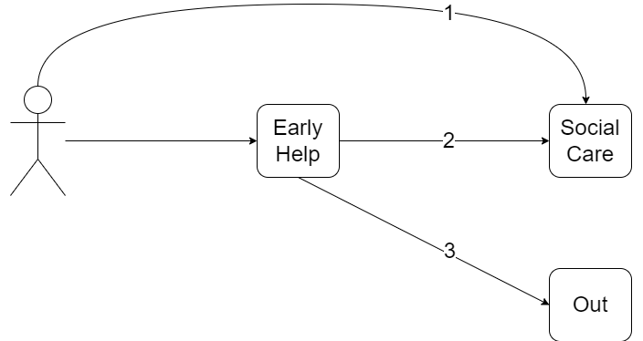

[*View source*](https://github.com/scc-pi/sankeysheff/blob/main/sankey.Rmd) {width="24"}

```{r setup, include=FALSE}
knitr::opts_chunk$set(echo = TRUE)

# Packages ----
library(tidyverse)
library(scales)
library(viridis)
library(patchwork)
library(hrbrthemes)
library(circlize)
library(networkD3)
library(gt)
library(gtExtras)
library(igraph)

# Functions ----
display_tbl <- function(df){
  df %>%  
    gt %>% 
    gt_theme_538() %>% 
    tab_options(table.font.size = 12, table.align = "left") 
}
```

# Introduction  

> Sankey Diagrams are directed, weighted graphs.  

> Sankey Diagrams are particularly appropriate for representing flow through a system in that it gives an immediate visualisation of the weight of the flows and thus enables priority areas to be identified and tackled.

The purpose of these notes is to explore how to use Sankey diagrams via R. In particular, for the Early Intervention & Prevention programme (EIP).  

We have had some initial success producing Sankey diagrams for Pass 1 of the Children's Early Help (CEH) project, which is part of the EIP programme. To build on this success we need to better understand:  

1. Network analysis, of which Sankeys are a part.  
1. JavaScript, and in particular the D3 library, for dynamic, interactive data visualisations in web browsers.  

## Network analysis  

"Vertices" and "edges" seem to be the common terms used in network analysis books. Probably not as intuitive as the terms "nodes" and "links" used in some R packages. "Points" and "lines" would probably not differentiate it enough from a regular x and y axis graph. "Junctions" and "roads" too metaphorical? The "amount of traffic", "weight", "size of flow", "value", "edge attribute", all relate to how much is passing from one vertex to another.

[Introduction to Network Analysis with R](https://www.jessesadler.com/post/network-analysis-with-r/)  

Chapter on [Network analysis with R](https://thomasdegraaff.nl/ResearchTools/network-analysis-with-r.html) from [Research Tools for Social Scientists](https://thomasdegraaff.nl/ResearchTools/index.html).  

[Network Analysis and Visualization with R and igraph](https://kateto.net/netscix2016.html)  

[Network Analysis and Visualization in R: Quick Start Guide](https://www.amazon.co.uk/dp/B077RHSB3Y/ref=dp-kindle-redirect?_encoding=UTF8&btkr=1)  

[A User’s Guide to Network Analysis in R](https://link.springer.com/book/10.1007/978-3-319-23883-8)  

## networkD3 package

These notes are going to focus on using the `networkD3` R package: 
[christophergandrud.github.io/networkD3/](https://christophergandrud.github.io/networkD3/).

Other Sankey and Alluvial specific packages were considered. However, `networkD3` seemed the best bet in terms of package maintenance and examples. Plus, familiarity with the package could help us produce other types of network diagrams. Consideration of other packages was not especially thorough.

The example followed initially in the CEH project was:
[Most basic Sankey Diagram – the R Graph Gallery (r-graph-gallery.com)](https://r-graph-gallery.com/321-introduction-to-interactive-sankey-diagram-2.html). However, the [R Gallery Book](https://bookdown.org/content/b298e479-b1ab-49fa-b83d-a57c2b034d49/flow.html#sankey-diagram) would have been better.

# Sankey example  

We've had some reasonable success with initial Sankey outputs in the CEH project. As ever though, there's room to improve how legible and reusable our code is. We're also starting to look into a level of control that requires JavaScript.  

We're going to look at a couple of things initially: 

1. A good outline of the Sankey process using the `networkD3` package - 
[RPubs - Introduction to Creating Sankey diagrams for Educational Research In R](https://rpubs.com/droach/CPP526-codethrough).  
1. Using the [`igraph` R package](https://igraph.org/r/) as suggested by the [`networkD3` documentation](https://christophergandrud.github.io/networkD3/#igraph).

## Sample data 

```{r ceh-simple-png}
#| echo=FALSE,
#| out.width="60%",
#| out.extra = 'style="float:right; padding:10px"' 

```

We'll use the groupings we have of children that receive either Early Help or Social Care interventions.

<div class="row"/>  

> Create a data frame of nodes

```{r nodes-df, class.source="fold-hide", fig.align='left'}
# Nodes of our groups with some sample data
ceh_groups <- tribble(
    ~GROUP,      ~CHILDREN,     
    "1 SC",     4000,
    "2 EH SC",  4000,
    "3 EH",     22000
  )

# Starting node i.e. our cohort of children
ceh_children <- ceh_groups %>% 
  count(wt = CHILDREN, name = "CHILDREN", GROUP = "Children")

# Early Help node
ceh_early_help <- ceh_groups %>% 
  filter(GROUP != "1 SC") %>% 
  count(wt = CHILDREN, name = "CHILDREN", GROUP = "Early Help")

# Combine the nodes in a single data frame
ceh_nodes <- bind_rows(ceh_children, ceh_early_help, ceh_groups)

# Tidy as we go
rm(ceh_groups, ceh_children, ceh_early_help)

# Display nodes table
ceh_nodes %>% 
  display_tbl() %>% 
  fmt_number(columns = CHILDREN, decimals = 0, use_seps = TRUE)
```

<br/>  

> Create a data frame of connections 

```{r connections-df, class.source="fold-hide"}
# Connections data frame
ceh_connections <- tribble(
    ~from,        ~to,     
    "Children",   "1 SC",
    "Children",   "Early Help",
    "Early Help", "2 EH SC",
    "Early Help", "3 EH"
  ) %>% 
  left_join(ceh_nodes, by = c("to" = "GROUP")) #add edge attribute

# Display connections table
ceh_connections %>% 
  display_tbl() %>% 
  fmt_number(columns = CHILDREN, decimals = 0, use_seps = TRUE)
```

## igraph  

Using `igraph` might be akin to the use of data standards and APIs i.e. a useful agreed common format, for network analysis. Initially it's use appears an unnecessary complication, but down the line its value may become more apparent.  

```{r igraph-example}
# Create the igraph object by passing it a data frame containing a symbolic edge
# list in the first 2 columns e.g. from & to.
# Additional columns are considered as edge attributes.
ceh_graph <- graph_from_data_frame(
  ceh_connections, 
  vertices = ceh_nodes, #data frame with vertex metadata
  directed = TRUE
)

# Convert to object suitable for networkD3
# One data frame of 'links' and another of 'nodes' returned in a list.
ceh_d3 <- igraph_to_networkD3(ceh_graph, what = "both")

# Display links table
ceh_d3$links %>% 
  display_tbl %>% 
  fmt_number(columns = value, decimals = 0, use_seps = TRUE)

# Display nodes table
ceh_d3$nodes %>% 
  display_tbl()

# Display D3 Sankey diagram
sankeyNetwork(
  Links = ceh_d3$links, 
  Nodes = ceh_d3$nodes,
  Source = "source", 
  Target = "target", 
  Value = "value",
  NodeID = "name",
  nodeWidth = 40,
  fontSize = 13,
  nodePadding = 20
)
```

# Colours  


# Add tooltips
Add tooltips via HTMLWidgets JavaScript:
[sankey diagram - How to not display values in the nodes or the links in SankeyDiagram using networkD3 in R - Stack Overflow](https://stackoverflow.com/questions/58786387/how-to-not-display-values-in-the-nodes-or-the-links-in-sankeydiagram-using-netwo)

# Dummy nodes

# Save As  

## HTML  


## PNG etc.
